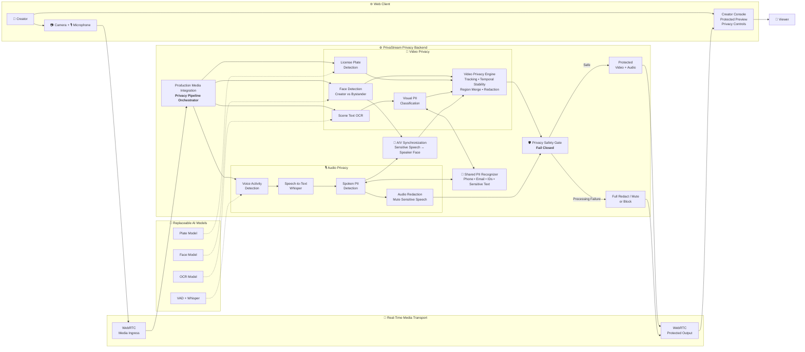

# PrivaStream

PrivaStream is a privacy-first media processing platform foundation. Its planned
pipeline accepts live or recorded media, detects privacy-sensitive content, and
produces a protected output with faces, plates, on-screen text, and sensitive
speech redacted as configured.

The current repository contains the web and API foundation, a creator privacy
console with production client adapters at the browser boundary, a reusable
browser-local WebRTC media loopback with deterministic mock processing, normalized detector contracts,
shared model-agnostic video orchestrator/compositor, production plate and
OCR/visual-PII adapters, timestamped audio ingestion/transcription pipeline,
standalone face enrollment/matching, the production face adapter and protected
enrollment/readiness control surface, standalone license-plate/OCR
visual-privacy and spoken-PII detector/renderer modules, centralized privacy
readiness/publication decisions, cross-modal spoken-PII visual augmentation,
the production privacy-media integration adapter and protected-output sink
boundary, and a local PostgreSQL-backed Docker Compose topology. HTTP media
ingestion, backend creator operations beyond protected face enrollment,
server-side or production transport, durable persistence, and the browser
bridge to server safety events are planned and are not implemented yet.

## Architecture

PrivaStream acts as an AI privacy layer between a creator's raw camera/microphone
stream and the viewer. Video and audio are processed independently, correlated
when needed, and passed through a fail-closed safety gate before protected media
can leave the backend.



The core privacy invariant is simple: **raw camera/microphone media may enter the
privacy pipeline, but only protected media—or an explicit fail-closed
fallback/block decision—may leave it.**

## Repository layout

- `apps/web` — runnable Next.js browser and creator application.
- `apps/api` — runnable FastAPI backend and current in-process privacy/media
  processing runtime.
- `models/` — runtime model manifests and verified artifact metadata; downloaded
  weights stay in an ignored local cache.
- `ml/` — offline training and evaluation tooling, including the reproducible
  benchmark runner under `ml/evaluation/`.
- `datasets/` — safe dataset manifests and metadata, not raw/private datasets.
- `docs/` — authoritative product, architecture, security, operations, and
  continuity documentation.

`apps/` contains runnable applications only. There is no separate model or
inference service; model-backed processing remains in `apps/api` until an
approved isolation requirement exists.

## Local development

```bash
pnpm install
pnpm dev
```

The web app is served at `http://localhost:3000`; the API is served at
`http://localhost:8000`, with process health at `/health`.

For the packaged CPU topology, copy `.env.example` to `.env` and run:

```bash
pnpm prod:up
```

The GPU topology uses the same application images and adds an NVIDIA device
reservation only to the API:

```bash
pnpm prod:up:gpu
```

Set `NEXT_PUBLIC_API_BASE_URL` before building when the browser must use an API
origin other than `http://localhost:8000`. The example environment selects the
local `plate-detector` manifest; the API entrypoint invokes the #14 verified
bootstrap into the persistent model-cache volume when the ignored local weight
is present. Set `PRIVASTREAM_MODEL_ID` to an approved manifest ID to change the
model or leave it blank to skip container bootstrap. Set
`PRIVASTREAM_FACE_MODEL_ID` for an explicit face-pack manifest; the entrypoint
bootstraps both IDs when both are configured. Archive packs are extracted only
after checksum verification. These packaged topologies expose only the
implemented web, API, and database ports. Server WebRTC/signaling ports remain
owned by #21 and are not invented here.

The web app at `http://localhost:3000` includes the creator privacy console.
Configure a policy, grant browser device permission, and review production
readiness before starting a session. The console uses the reusable browser
media client and calls the configured face control routes; missing or failed
readiness, enrollment, safety, or transport boundaries remain fail-closed. The
default API denies face control authorization, and the browser-to-transport
bridge for #13 decisions is not connected yet, so a complete protected session
is not currently available. See `apps/web/README.md` for configuration.

The API also contains a standalone local spoken-PII demo backed by the
timestamped chunk normalizer, bounded speech segmenter, and transcription
pipeline. It applies shared text-PII intervals to source chunks and blocks
unsafe release; it is not exposed as an API route and requires the optional
audio dependencies:

```bash
uv sync --project apps/api --extra audio
uv run --project apps/api python -m privastream_api.pipeline.spoken_pii input.wav output.wav
```

The demo accepts a bounded PCM16 WAV, detects speech, transcribes locally, and
writes a copy with detected phone-number and email intervals muted. It does not
persist raw audio or transcript text. Server-side transport, durable persistence,
external/background worker processes, and E2E infrastructure remain
unimplemented.

The API also contains a standalone local face demo and a protected face
enrollment/readiness control surface. The control routes require an injected
server-side creator authorizer; the default app denies them until that boundary
is configured. The standalone demo requires the optional face dependencies and a
local InsightFace model pack:

```bash
uv sync --project apps/api --extra face
uv run --project apps/api python apps/api/scripts/face_demo.py --input demo.mp4 --output protected.mp4 --model-root models/insightface
```

The API also contains `ProductionMediaIntegration`, an in-process adapter that
coordinates the production video, audio, optional cross-modal, and centralized
privacy-gate contracts before handing protected output to an injected sink. It
does not add an HTTP route or implement WebRTC/mediasoup; a server-side
transport adapter remains a separate planned boundary.

Runtime model weights are never committed. The local plate handoff manifest is
available now and points to the ignored `models/manifests/plate_detector.pt`
file. Fetch and verify it with:

```bash
uv run --project apps/api python -m privastream_api.model_artifacts fetch --model plate-detector
```

The same command returns an extracted directory for an archive model pack. For
the first local plate-only end-to-end visual flow, provide an input image or
short video and run:

```bash
uv sync --project apps/api --extra vision
uv run --project apps/api python apps/api/scripts/vision_demo.py \
  --input path/to/input.mp4 \
  --output artifacts/plate-protected.mp4 \
  --plate
```

With `--plate` and no explicit weight path, the demo resolves
`plate-detector`, verifies the local file, runs Ultralytics, and writes the
blurred output. OCR and face detectors are not enabled. This is the current
local media flow; the packaged API still has no server-side media-ingestion
route. For the production face adapter, configure `PRIVASTREAM_FACE_MODEL_ID`
with an `insightface-pack` archive manifest.

See [Product](docs/PRODUCT.md), [Architecture](docs/ARCHITECTURE.md), and
[Operations](docs/OPERATIONS.md) for current boundaries, planned behavior, and
local commands. See [Visual Privacy](docs/PRIVACY_VISION.md) and
[Face Privacy](docs/PRIVACY_FACE.md) for the standalone detector modules.

The offline benchmark runner consumes normalized labels and predictions and
writes machine-readable JSON plus a human-readable Markdown report. Its
mandatory provenance and plate metric workflow are documented in
[`ml/evaluation/README.md`](ml/evaluation/README.md).
