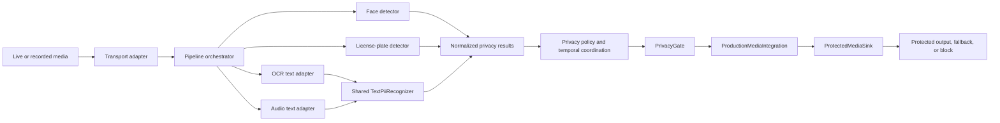
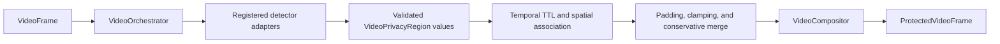
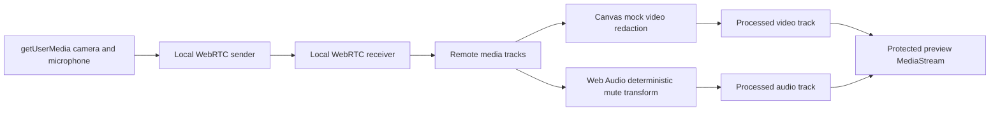
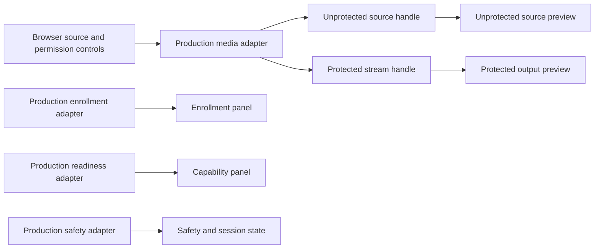

# Architecture

## Purpose

This document owns the current repository topology, component responsibilities,
process boundaries, dependencies, and data flows.

## Current repository topology

- `apps/web` is the Next.js App Router browser and creator UI. Its current page
  renders the creator console through production client adapters; the reusable
  browser media loopback remains in `src/lib/browser-media-session.ts`.
- `apps/api` is the FastAPI control-plane foundation. It exposes `GET /health`
  plus protected face enrollment/readiness control routes and contains normalized media contracts, standalone visual-privacy adapters
  under `src/privastream_api/privacy/vision`, the model-agnostic video
  orchestrator/compositor under `src/privastream_api/pipeline/video.py`, the
  centralized privacy readiness/publication gate under
  `src/privastream_api/pipeline/safety.py`, the
  standalone face module under `src/privastream_api/privacy/face`, and the
  shared text-PII recognizer under `src/privastream_api/privacy/text_pii.py`,
  plus the timestamped audio ingestion/transcription path under
  `src/privastream_api/pipeline/audio.py`, the optional cross-modal adapter,
  and the protected media integration under
  `src/privastream_api/pipeline/media_integration.py`.
- `models/` contains runtime model metadata and the future manifest boundary;
  it is not a model server and must not contain downloaded weights.
- `ml/` contains offline training, fine-tuning, and evaluation tooling. Runtime
  API code must not import training-only dependencies by default.
- `datasets/` contains safe dataset manifests, schemas, split metadata, and
  provenance; raw or private datasets are not part of the repository.
- `docs/` contains the authoritative product, architecture, security,
  operations, and current-state documentation.
- `compose.yaml` defines the local development topology:
  - `web` serves the Next.js development server on port 3000;
  - `api` serves FastAPI on port 8000; and
  - `db` runs PostgreSQL on port 5432.
- `apps/api/Dockerfile.dev` and `apps/web/Dockerfile.dev` provide development
  images with mounted source trees and persistent dependency volumes.

The standalone face and plate/OCR modules, their production plate and OCR/PII
adapters, process-local face enrollment repository and readiness tracker, shared
text-PII recognizer, shared video orchestrator/compositor, timestamped audio
pipeline, spoken-PII detector, local PCM16 renderer, cross-modal synchronizer,
and centralized privacy gate are implemented inside the API package. Face control
routes are protected by an injected server-side creator authorizer and are not a
media transport surface. The browser-local loopback is implemented without an
API dependency. The production media integration coordinates the in-process
processors and exposes a protected-output sink contract, but it does not
provide server-side signaling or live transport. Real-time media transport,
durable persistence, external worker process, provider integration, and E2E
runtime boundaries do not exist yet. `apps/` contains only runnable
application boundaries; there is no separate model/inference service.

`apps/web/src/lib/media-session-client.ts` owns the reusable typed media-session
client boundary. `production-clients.ts` adapts the browser loopback and current
face control routes into the console's source/protected handles, enrollment,
readiness, and safety interfaces. The older typed mocks remain available as
fixtures, but the page does not instantiate them. The browser adapter never
passes its source stream to the protected-preview component.

## Runtime boundaries

| Boundary | Responsibility | Availability |
| --- | --- | --- |
| Browser/creator UI | Render the creator console, source/device controls, enrollment consent/status, capability readiness, safety state, and separate source/protected-preview boundaries through client adapters. | Implemented adapter path; Unverified |
| API/control plane | Own future sessions, privacy policies, pipeline lifecycle, and authorization. The current surface reports process liveness and exposes an injected-authorization face enrollment/readiness boundary. | Implemented foundation and face control boundary; broader product operations Planned |
| Media processing/inference | Run normalized detector adapters, timestamped audio segmentation/transcription, cross-modal source-time coordination, temporal region coordination, and generic video composition in-process with the API until GPU/runtime isolation requires a separate process. | Implemented video/audio source paths, face, visual, production face adapters, cross-modal synchronizer, and integration adapter; runtime transport pipeline Planned |
| Privacy safety policy | Evaluate required/optional capability readiness, source-time watermark/lag coverage, liveness, panic, recovery, and publication actions in one in-process gate; the integration adapter applies the result before handing output to a sink. | Implemented gate and protected-output integration boundary; server transport integration Planned |
| Real-time media transport | Move live media and protected output without coupling transport to a detector implementation. The current browser baseline uses a same-page WebRTC loopback; server-side and production transport remain absent. | Implemented browser baseline; broader transport Planned |
| Persistence/configuration | Store only the configuration and lifecycle state later approved for persistence. Face enrollment is process-local; PostgreSQL is provisioned locally but unused. | Implemented process-local face lifecycle; durable persistence Planned |

The design starts in-process. A separate service or worker requires a concrete
runtime or GPU dependency; conceptual separation alone is not a reason to add
one.

## Processing flow

The intended flow is:

1. A future browser or transport adapter supplies live or recorded media.
2. The in-process orchestrator sends video frames and audio segments to
   independent detector modules.
3. OCR and speech adapters normalize their extracted text and share the
   modality-neutral `TextPiiRecognizer`; each adapter then maps spans back to
   visual regions or source-timestamped audio intervals.
4. Detectors return model-neutral results defined by the API contract module.
5. The centralized `PrivacyGate` evaluates capability policy, readiness,
   source-time coverage, liveness, panic, recovery, and fail-closed rules.
6. `ProductionMediaIntegration` combines protected video/audio candidates,
   optional cross-modal regions, and the `PrivacyGate` decision. It applies
   protected output, full-redact fallback, or block behavior to an injected
   `ProtectedMediaSink`; a future transport adapter owns the sink implementation.

### Current shared video engine

The implemented model-agnostic video path is:

The orchestrator schedules detectors at configured cadence, applies per-detector
deadlines and concurrency limits, preserves temporal masks across skipped or
failed detector frames until TTL expiry, and releases completed frames in input
order. Detector failures remain explicit in the output metadata. The compositor
provides blur, pixelate, solid cover, and full-frame safe-cover primitives; the
`PrivacyGate` owns whether a frame may be published or must use a safe fallback.

The plate production adapter in `privacy/vision/plate_detector.py` wraps the
standalone plate inference boundary for this scheduler. It supplies a
`FrameContext` from each canonical `VideoFrame`, returns source-frame regions,
and leaves production cadence, TTL, padding, deadlines, and failure status to
the shared engine.

### Current timestamped audio path

The timestamped audio path is transport-independent and feeds the same
interfaces from the prerecorded runner that a future live transport can use:

```mermaid
flowchart LR
    A[AudioChunk source timeline] --> B[PCM normalizer]
    B --> C[Bounded VAD ring buffer]
    C --> D[SpeechSegment]
    D --> E[Bounded transcription workers]
    E --> F[TimestampedTranscript]
    F --> G[Shared TextPiiRecognizer]
    G --> H[AudioRedactionInterval]
    H --> I[Source-chunk muter]
    I --> J[Protected chunks + release decision]
```

`AudioChunk.end_timestamp_ms` is derived from sample count, and normalized
chunks retain source start timestamps while converting to mono float32 at the
configured model rate. `SpeechSegmenter` retains only configured pre-roll
context, applies post-roll, and splits long speech at deterministic sample
boundaries. The queue bounds segment count and duration; transcription deadline,
VAD, unclassified speech, input-timeline, and worker failures return explicit
unsafe statuses. The
spoken adapter normalizes transcript tokens and maps the shared recognizer's
spans back to source timestamps. The pipeline applies canonical intervals to the
original chunks, including intervals that cross chunk boundaries, and returns a
safe release watermark/lag only after protected chunks are produced. It keeps
transcript words in an in-memory result for the local sink and does not log or
persist them.

The face production adapter in `privacy/face/production.py` wraps
`CreatorFaceDetector` from #18 for the same scheduler. It returns only canonical
`face_bystander` regions, preserves unavailable and execution failures for the
scheduler, and records sanitized readiness input for #13. The same module owns
the process-local enrollment repository and protected control-plane route
boundary; it does not copy face inference or matching logic.

The OCR production adapter in `privacy/vision/ocr_detector.py` wraps the
standalone OCR engine and shared `TextPiiRecognizer` for this scheduler. It
preserves OCR-specific normalization and maps sensitive spans to source OCR
blocks, while leaving cadence, TTL, padding, deadlines, and failure status to
the shared engine.

### Current browser loopback path

The current browser demo provides the smallest transport-independent media path:

The sender and receiver are separate `RTCPeerConnection` objects in the same
browser page, with offer/answer and ICE candidate exchange performed locally.
The incoming tracks are the processing boundary: video is rendered through a
canvas with a fixed center redaction region, and audio passes through a gain
node that mutes a fixed 500 ms interval every 2 seconds. The output preview is
created only after both processed tracks exist; capture tracks are never used as
the output preview source.

The browser controller exposes each processed video frame's source timestamp
from the media callback when available, with a monotonic capture-clock fallback,
for later detector and A/V integration. Its single-frame scheduling loop has at
most one pending frame, so a slow draw cannot build an unbounded queue. A device
disconnect, transport failure, or processor failure stops the session and leaves
the output detached instead of falling back to raw media.

The browser foundation, browser-local loopback, creator-console adapter path, API
process-health route, local Compose topology, shared video engine, timestamped
spoken-PII audio path, production face integration, standalone face, plate/OCR,
text-PII paths, cross-modal synchronization primitive, production media
integration adapter, and creator-console client adapters are present. Server-side
live transport, #13 safety event delivery, and protected delivery beyond the
injected sink remain Planned.

### Current creator-console path

The current `/` route uses the production client boundary. The browser media
baseline is local, while face control requests use the configured API origin:

The `Protected output` component accepts only a protected handle returned by
the media-client façade. The source handle is rendered separately and is never
substituted into that component. Required capability unavailability holds the
protected handle, panic stops clear it, and unavailable client/API boundaries
hold publication. The adapter maps sanitized responses and status failures into
connecting, processing, degraded, blocked, panic, and stopped presentation
without exposing raw response details. The current API has no server media or
safety event routes, so those paths remain fail-closed until their owning
boundaries are available.

## Detector and redaction contracts

`privastream_api.pipeline.contracts` is the shared boundary for independent
detector work:

- `VideoRegionDetection` represents a face, protected bystander face, license-plate, OCR, spoken-PII visual augmentation, email, or phone result with
  normalized `x`, `y`, `width`, and `height` coordinates in the inclusive
  `[0, 1]` frame space, a confidence, a frame timestamp, and an optional track
  identity.
- `VideoFrame` is the canonical source-frame envelope. Its optional payload is
  kept opaque to detector adapters; the dependency-free compositor accepts its
  `RasterFrame` adapter surface.
- `VideoPrivacyRegion` is the validated, padded, clamped, TTL-bearing region
  retained by the shared video engine. `ProtectedVideoFrame` carries ordered
  output, active regions, sanitized detector runs, and render status without
  claiming publication safety.
- `AudioRedactionInterval` represents a time-based spoken-PII redaction with
  millisecond start and end offsets, confidence, detector identity, and an
  optional reason.
- `CapabilityObservation` reports sanitized capability state, source-time
  watermark, processing lag, and a safe reason code; `CapabilityPolicy` marks
  each enabled capability as required or optional and may set a lag limit.
- `PrivacyGate` evaluates those observations with a `MediaWindow` and returns
  one `PublicationDecision`: `publish_protected`, `full_redact`, or `block`.
  It also owns process liveness, immediate panic, explicit exit, and consecutive
  healthy recovery without inspecting media buffers.
- `AudioReleaseDecision` reports whether the processed source batch is safe to
  release, its source-timeline watermark, processing lag, and a safe reason
  when blocked.
- `FaceGeometry` is the sanitized normalized face-box boundary consumed by the
  cross-modal layer. It may include a supplied lower-face region or an
  active-speaker score, but the synchronizer never invokes a face detector or
  exposes embeddings.
- `AudioIntervalIndex` stores de-duplicated source-timestamped spoken-PII
  intervals for deterministic overlap queries. `CrossModalSynchronizer` owns
  bounded video lookahead, pre/post padding, face association, conservative
  fallback regions, late-decision reporting, and source-time metrics; it does
  not mute audio, compose pixels, or decide publication safety.
- `ProductionMediaIntegration` coordinates the video, audio, optional
  cross-modal, and gate contracts for one source window. `ProtectedMediaSink`
  receives only the gate decision and protected payloads; the adapter never
  substitutes a raw source frame or chunk when processing fails.
- `AudioChunk` is the timestamped input envelope. It carries sequence identity,
  sample rate, channel count, PCM format, and sample buffer; its exact end time
  is derived from sample count rather than wall-clock processing time.
- `SpeechSegment` is a bounded mono model-input window. `AudioNormalizer` owns
  downmixing and deterministic resampling, while `SpeechSegmenter` owns the
  bounded ring buffer, pre/post-roll, and maximum-duration splitting.
- `FaceDetector`, `LicensePlateDetector`, and `OcrDetector` each accept a
  `VideoFrame` and return normalized `VideoRegionDetection` values.
- `CreatorFaceEnrollmentService` accepts explicitly consented image samples,
  aggregates normalized ArcFace embeddings in an in-memory hackathon store, and
  supports replacement and deletion without exposing embedding values.
- `CreatorFaceDetector` consumes the replaceable `FaceModel` boundary and emits
  only `face_bystander` regions. Unknown, low-quality, failed, and ambiguous
  creator matches remain protected. It does not own production padding,
  temporal retention, or rendering.
- `AudioPiiDetector` accepts an `AudioSegment` and returns normalized
  `AudioRedactionInterval` values.
- `SpokenPiiDetector` implements the speech-specific bridge by composing a
  bounded VAD, a local word-timestamp transcriber, spoken-token normalization,
  the shared `TextPiiRecognizer`, configurable safety padding, and
  adjacent-interval merging.
- `AudioPipeline` owns ordered chunk validation, bounded transcription queue
  limits, processing deadlines, source-chunk muting, release watermark/lag, and
  sanitized unsafe outcomes. It composes the existing
  `VoiceActivityDetector` and `LocalTranscriber` interfaces rather than
  coupling streaming policy to Faster-Whisper.
- `EnergyVoiceActivityDetector` is the dependency-free baseline; the optional
  `SileroVoiceActivityDetector` uses the Silero adapter without changing the
  normalized contract. `FasterWhisperTranscriber` is loaded lazily so the API
  health process does not load an ML model.
- `mute_audio_chunk` and `mute_audio_chunks` apply canonical intervals to the
  original PCM16 or float32 source chunks, conservatively muting any overlapping
  frame while preserving format, sequence, and source timestamps. They do not
  expose model-specific transcript output.

The standalone plate/OCR adapters use a `FrameContext` containing source image
data and `VideoFrame` metadata, then emit the same normalized result type. The
production plate and OCR adapters use injectable source-image providers because
the canonical frame payload remains opaque to the model runtime.

The production face adapter uses the canonical frame payload as its source-image
provider and delegates all observation, embedding, and identity behavior to the
standalone face module. Its `FaceReadinessTracker` reports model, enrollment,
and detector failure reasons without making a publication decision.

Detector implementations must not expose model-specific boxes, timestamps, or
labels beyond these contracts. The compositor consumes normalized values; it
does not import a detector implementation. A timeout, unavailable detector,
invalid result, or execution error is recorded explicitly and is never converted
to a successful empty detection.

## Failure boundaries and privacy invariant

The target processing pipeline fails closed: if a detector required by the
active privacy policy cannot make a safe decision, the protected output is held
or redacted rather than released as if it were safe. The in-process
`PrivacyGate` evaluates sanitized detector observations, and
`ProductionMediaIntegration` applies its decision before output reaches the
injected sink. HTTP and server-transport consumers have not yet been wired to
that sink. The standalone adapters and production face adapter surface detector
failures, while the face readiness route supplies sanitized input to the gate
and does not authorize publication.

## Dependencies and verification

The frontend depends on Node.js and pnpm. The API depends on CPython 3.14 and
uv. Docker Compose supplies the local process and PostgreSQL boundaries.
Compose healthchecks cover process liveness only; they do not prove product
readiness, detector accuracy, redaction correctness, or transport readiness.

The foundation, normalized contracts, shared video engine, cross-modal synchronizer,
standalone visual-privacy adapters and production plate/OCR adapters, timestamped audio
pipeline, standalone face and production face integration, shared text-PII
modules, spoken-PII detector baseline, local renderer, privacy gate,
browser-local loopback, production media integration adapter, and creator-console
client adapters are Implemented in source.
Runtime verification is Unverified; the console, orchestration and audio-pipeline
tests, browser path, audio and visual demos, real-model inference, API control
routes, and application verification have not been exercised.
