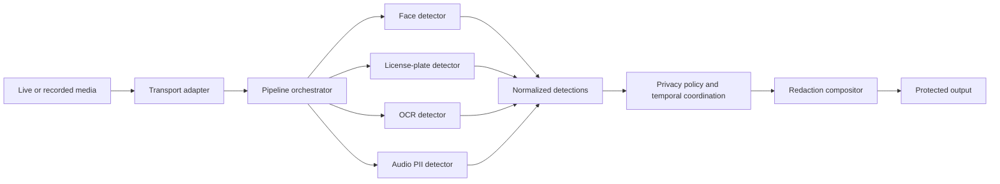

# Architecture

## Purpose

This document owns the current repository topology, component responsibilities,
process boundaries, dependencies, and data flows.

## Current repository topology

- `apps/web` is the Next.js App Router browser and creator-UI foundation.
- `apps/api` is the FastAPI control-plane foundation. It exposes `GET /health`
  and contains normalized media contracts plus the in-process spoken-PII demo
  in `src/privastream_api/pipeline/`.
- `compose.yaml` defines the local development topology:
  - `web` serves the Next.js development server on port 3000;
  - `api` serves FastAPI on port 8000; and
  - `db` runs PostgreSQL on port 5432.
- `apps/api/Dockerfile.dev` and `apps/web/Dockerfile.dev` provide development
  images with mounted source trees and persistent dependency volumes.

The spoken-PII detector and local PCM16 renderer are implemented inside the API
package. No cross-modal compositor, media transport, persistence layer, worker,
provider integration, or E2E runtime boundary exists yet.

## Runtime boundaries

| Boundary | Responsibility | Availability |
| --- | --- | --- |
| Browser/creator UI | Accept future creator controls and show protected output. The current page is a static foundation. | Implemented foundation; media controls Planned |
| API/control plane | Own future sessions, privacy policies, pipeline lifecycle, and authorization. The current route only reports process liveness. | Implemented foundation; product operations Planned |
| Media processing/inference | Run detector modules and redaction orchestration in-process with the API until GPU/runtime isolation requires a separate process. The standalone spoken-PII module is the first implemented local path. | Implemented baseline; broader processing Planned |
| Real-time media transport | Move live media and protected output without coupling transport to a detector implementation. | Planned |
| Persistence/configuration | Store only the configuration and lifecycle state later approved for persistence. PostgreSQL is provisioned locally but unused. | Planned |

The design starts in-process. A separate service or worker requires a concrete
runtime or GPU dependency; conceptual separation alone is not a reason to add
one.

## Processing flow

The intended flow is:

1. A future browser or transport adapter supplies live or recorded media.
2. The in-process orchestrator sends video frames and audio segments to
   independent detector modules.
3. Detectors return model-neutral results defined by the API contract module.
4. A future policy layer applies whitelist, redaction, temporal-stability, and
   fail-closed rules.
5. A future compositor creates the protected output for the selected transport.

The browser foundation, API process-health route, local Compose topology, and
standalone spoken-PII audio path are present. Live transport, cross-modal
policy, compositor, and protected delivery remain Planned.

## Detector and redaction contracts

`privastream_api.pipeline.contracts` is the shared boundary for independent
detector work:

- `VideoRegionDetection` represents a face, license-plate, or OCR result with
  normalized `x`, `y`, `width`, and `height` coordinates in the inclusive
  `[0, 1]` frame space, a confidence, a frame timestamp, and an optional track
  identity.
- `AudioRedactionInterval` represents a time-based spoken-PII redaction with
  millisecond start and end offsets, confidence, detector identity, and an
  optional reason.
- `FaceDetector`, `LicensePlateDetector`, and `OcrDetector` each accept a
  `VideoFrame` and return normalized `VideoRegionDetection` values.
- `AudioPiiDetector` accepts an `AudioSegment` and returns normalized
  `AudioRedactionInterval` values.
- `SpokenPiiDetector` implements the audio detector boundary by composing a
  bounded VAD, a local word-timestamp transcriber, structured phone/email
  matching, configurable safety padding, and adjacent-interval merging.
- `EnergyVoiceActivityDetector` is the dependency-free baseline; the optional
  `SileroVoiceActivityDetector` uses the Silero adapter without changing the
  normalized contract. `FasterWhisperTranscriber` is loaded lazily so the API
  health process does not load an ML model.
- The local renderer accepts PCM16 WAV input and mutes only normalized source
  time intervals. It does not expose model-specific transcript output.

Detector implementations must not expose model-specific boxes, timestamps, or
labels beyond these contracts. The future compositor consumes normalized values;
it does not import a detector implementation.

## Failure boundaries and privacy invariant

The target processing pipeline fails closed: if a detector required by the
active privacy policy cannot make a safe decision, the protected output is held
or redacted rather than released as if it were safe. This policy is Planned and
is not implemented by the current health-only scaffold.

## Dependencies and verification

The frontend depends on Node.js and pnpm. The API depends on CPython 3.14 and
uv. Docker Compose supplies the local process and PostgreSQL boundaries.
Compose healthchecks cover process liveness only; they do not prove product
readiness, detector accuracy, redaction correctness, or transport readiness.

The foundation, normalized contracts, spoken-PII detector baseline, and local
renderer are Implemented in source. Runtime verification is Unverified; the
audio demo and model inference have not been exercised, and the earlier Compose
startup attempt did not reach a healthy web/API stack.
