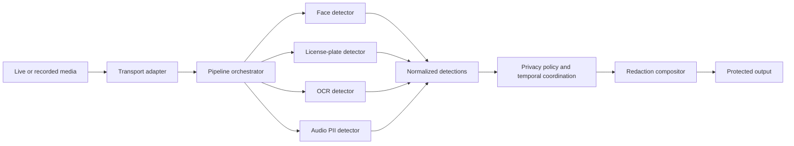
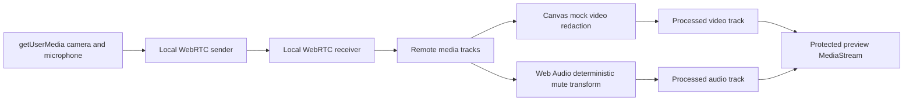
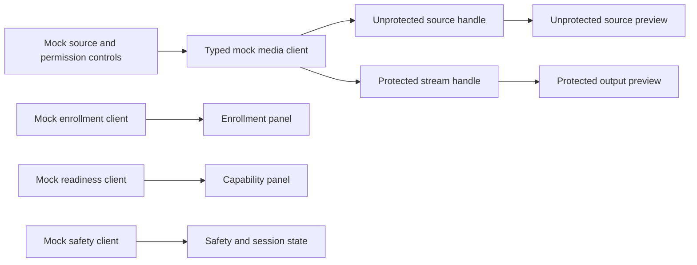

# Architecture

## Purpose

This document owns the current repository topology, component responsibilities,
process boundaries, dependencies, and data flows.

## Current repository topology

- `apps/web` is the Next.js App Router browser and creator UI. Its current page
  renders the creator console shell against typed mock façades; the reusable
  browser media loopback remains in `src/lib/browser-media-session.ts`.
- `apps/api` is the FastAPI control-plane foundation. It exposes `GET /health`
  and contains normalized media contracts, standalone visual-privacy adapters
  under `src/privastream_api/privacy/vision`, and the in-process spoken-PII demo
  under `src/privastream_api/pipeline/`.
- `models/` contains runtime model metadata and the future manifest boundary;
  it is not a model server and must not contain downloaded weights.
- `ml/` contains offline training, fine-tuning, and evaluation tooling. Runtime
  API code must not import training-only dependencies by default.
- `datasets/` contains safe dataset manifests, schemas, split metadata, and
  provenance; raw or private datasets are not part of the repository.
- `docs/` contains the authoritative product, architecture, security,
  operations, and current-state documentation.
- `compose.yaml` defines the local development topology:
  - `web` serves the Next.js development server on port 3000;
  - `api` serves FastAPI on port 8000; and
  - `db` runs PostgreSQL on port 5432.
- `apps/api/Dockerfile.dev` and `apps/web/Dockerfile.dev` provide development
  images with mounted source trees and persistent dependency volumes.

The standalone plate/OCR module, spoken-PII detector, and local PCM16 renderer
are implemented inside the API package but are not exposed through the HTTP
product surface. The browser-local loopback is implemented without an API
dependency. No shared or cross-modal redaction compositor, server-side
real-time media transport, persistence layer, worker, provider integration, or
E2E runtime boundary exists yet. `apps/` contains only runnable application
boundaries; there is no separate model/inference service.

`apps/web/src/lib/media-session-client.ts` owns the reusable typed media-session
client boundary. The browser loopback implements it with real browser streams,
while `creator-console-clients.ts` implements the same boundary with typed mock
source/protected handles alongside the enrollment, readiness, and safety
façades.

## Runtime boundaries

| Boundary | Responsibility | Availability |
| --- | --- | --- |
| Browser/creator UI | Render the creator console, source/device controls, enrollment consent/status, capability readiness, safety state, and separate source/protected-preview boundaries against typed façades. | Implemented mock console; production controls Planned |
| API/control plane | Own future sessions, privacy policies, pipeline lifecycle, and authorization. The current route only reports process liveness. | Implemented foundation; product operations Planned |
| Media processing/inference | Run detector modules and redaction orchestration in-process with the API until GPU/runtime isolation requires a separate process. Standalone plate/OCR and spoken-PII adapters are available; the product pipeline is not. | Implemented modules; product pipeline Planned |
| Real-time media transport | Move live media and protected output without coupling transport to a detector implementation. The current browser baseline uses a same-page WebRTC loopback; server-side and production transport remain absent. | Implemented browser baseline; broader transport Planned |
| Persistence/configuration | Store only the configuration and lifecycle state later approved for persistence. PostgreSQL is provisioned locally but unused. | Planned |

The design starts in-process. A separate service or worker requires a concrete
runtime or GPU dependency; conceptual separation alone is not a reason to add
one.

## Processing flow

The intended flow is:

1. A future browser or transport adapter supplies live or recorded media.
2. The in-process orchestrator sends video frames and audio segments to
   independent detector modules.
3. Detectors return model-neutral results defined by the API contract module.
4. A future policy layer applies whitelist, redaction, temporal-stability, and
   fail-closed rules.
5. A future compositor creates the protected output for the selected transport.

### Current browser loopback path

The current browser demo provides the smallest transport-independent media path:

The sender and receiver are separate `RTCPeerConnection` objects in the same
browser page, with offer/answer and ICE candidate exchange performed locally.
The incoming tracks are the processing boundary: video is rendered through a
canvas with a fixed center redaction region, and audio passes through a gain
node that mutes a fixed 500 ms interval every 2 seconds. The output preview is
created only after both processed tracks exist; capture tracks are never used as
the output preview source.

The browser controller exposes each processed video frame's source timestamp
from the media callback when available, with a monotonic capture-clock fallback,
for later detector and A/V integration. Its single-frame scheduling loop has at
most one pending frame, so a slow draw cannot build an unbounded queue. A device
disconnect, transport failure, or processor failure stops the session and leaves
the output detached instead of falling back to raw media.

The browser foundation, browser-local loopback, creator-console mock shell, API
process-health route, local Compose topology, and standalone plate/OCR and
spoken-PII audio paths are present. Shared orchestration, cross-modal policy,
redaction output, server-side live transport, compositor, and protected delivery
beyond the local preview remain Planned.

### Current creator-console path

The current `/` route is a UI-only shell and does not acquire real devices or
call the API:

The `Protected output` component accepts only a protected handle returned by
the media-client façade. The source handle is rendered separately and is never
substituted into that component. Required capability unavailability holds the
protected handle, panic stops clear it, and mock state controls expose
connecting, processing, degraded, blocked, panic, and stopped presentation
without claiming that those states came from backend readiness.

## Detector and redaction contracts

`privastream_api.pipeline.contracts` is the shared boundary for independent
detector work:

- `VideoRegionDetection` represents a face, license-plate, OCR, email, or phone result with
  normalized `x`, `y`, `width`, and `height` coordinates in the inclusive
  `[0, 1]` frame space, a confidence, a frame timestamp, and an optional track
  identity.
- `AudioRedactionInterval` represents a time-based spoken-PII redaction with
  millisecond start and end offsets, confidence, detector identity, and an
  optional reason.
- `FaceDetector`, `LicensePlateDetector`, and `OcrDetector` each accept a
  `VideoFrame` and return normalized `VideoRegionDetection` values.
- `AudioPiiDetector` accepts an `AudioSegment` and returns normalized
  `AudioRedactionInterval` values.
- `SpokenPiiDetector` implements the audio detector boundary by composing a
  bounded VAD, a local word-timestamp transcriber, structured phone/email
  matching, configurable safety padding, and adjacent-interval merging.
- `EnergyVoiceActivityDetector` is the dependency-free baseline; the optional
  `SileroVoiceActivityDetector` uses the Silero adapter without changing the
  normalized contract. `FasterWhisperTranscriber` is loaded lazily so the API
  health process does not load an ML model.
- The local renderer accepts PCM16 WAV input and mutes only normalized source
  time intervals. It does not expose model-specific transcript output.

The standalone plate/OCR adapters use a `FrameContext` containing source image
data and `VideoFrame` metadata, then emit the same normalized result type.

Detector implementations must not expose model-specific boxes, timestamps, or
labels beyond these contracts. The future compositor consumes normalized values;
it does not import a detector implementation.

## Failure boundaries and privacy invariant

The target processing pipeline fails closed: if a detector required by the
active privacy policy cannot make a safe decision, the protected output is held
or redacted rather than released as if it were safe. The standalone adapters
surface detector failures, but the shared fail-closed output policy is Planned
and is not implemented by the current HTTP scaffold.

## Dependencies and verification

The frontend depends on Node.js and pnpm. The API depends on CPython 3.14 and
uv. Docker Compose supplies the local process and PostgreSQL boundaries.
Compose healthchecks cover process liveness only; they do not prove product
readiness, detector accuracy, redaction correctness, or transport readiness.

The foundation, normalized contracts, standalone visual-privacy adapters,
spoken-PII detector baseline, local renderer, browser-local loopback, and
creator-console mock shell are Implemented in source. Runtime verification is
Unverified; the console, browser path, audio and visual demos, real-model
inference, and application verification have not been exercised.
